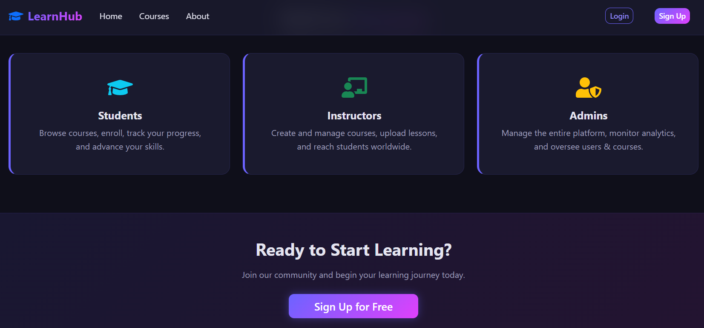
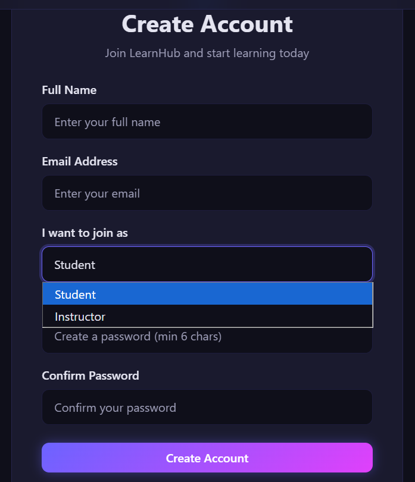
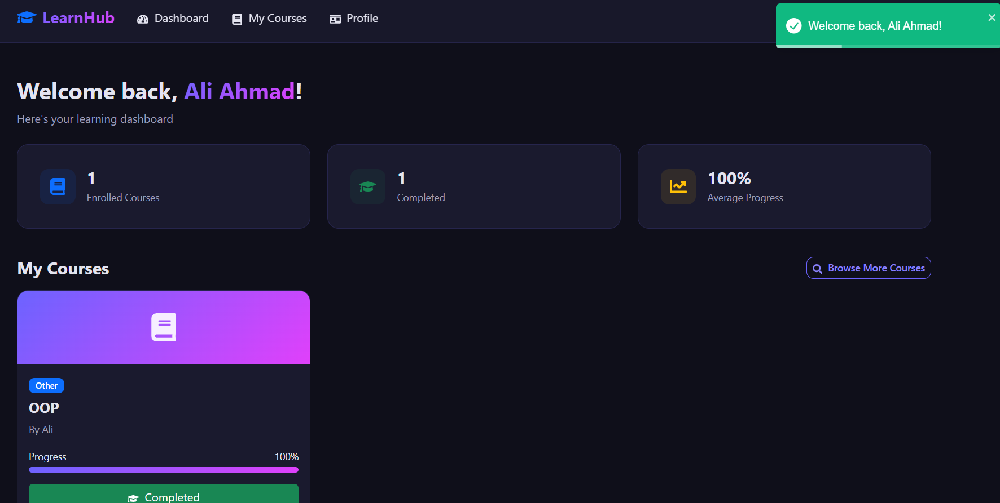
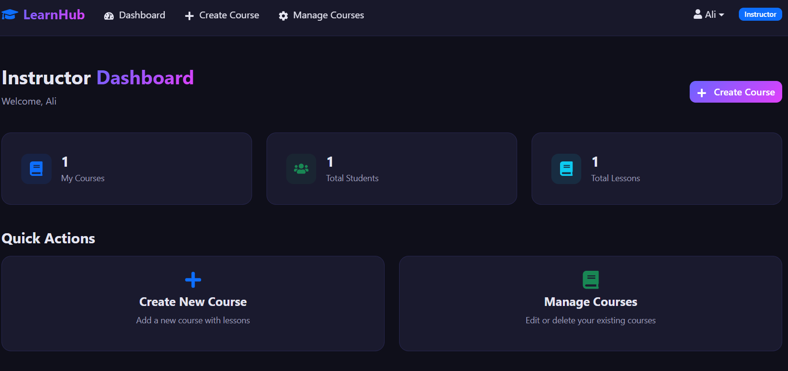
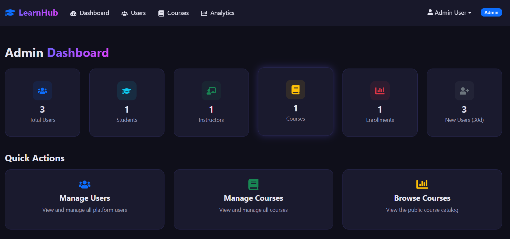

# 🎓 LearnHub - MERN Stack Learning Management System

A full-featured, production-level Learning Management System built with the MERN stack (MongoDB, Express.js, React, Node.js). Features JWT authentication, role-based access control, and a modern dark-themed UI.


## ✨ Features

### 🔐 Authentication & Authorization
- JWT-based authentication with bcrypt password hashing
- Role-based access control (Admin, Instructor, Student)
- Protected routes on both frontend and backend
- Secure token handling with auto-refresh

### 👥 Three User Roles

| Role | Capabilities |
|------|-------------|
| **Student** | Browse courses, enroll, track progress, view profile |
| **Instructor** | Create/edit/delete courses, add lessons, view students |
| **Admin** | Manage all users, manage all courses, view platform analytics |

### 📚 Course Management
- Create courses with multiple lessons
- Category-based filtering and search
- Course detail pages with enrollment
- Progress tracking for enrolled students

### 📊 Admin Analytics
- Total users, students, instructors count
- Course and enrollment statistics
- Top courses by enrollment
- Recent user signups (30-day window)
Email	admin@learnhub.com
Password	admin123

### 🎨 Modern UI
- Dark theme with glassmorphism effects
- Gradient accents and micro-animations
- Fully responsive design
- Toast notifications for user feedback

---

## 🏗️ Tech Stack

### Backend
- **Runtime:** Node.js
- **Framework:** Express.js
- **Database:** MongoDB with Mongoose ODM
- **Auth:** JSON Web Tokens (JWT) + bcryptjs
- **Config:** dotenv

### Frontend
- **Library:** React 19 (Vite)
- **Routing:** React Router DOM v7
- **HTTP Client:** Axios
- **UI Framework:** React Bootstrap + Bootstrap 5
- **Icons:** React Icons
- **Notifications:** React Toastify

---

## 📁 Project Structure

```
Final Project/
├── backend/
│   ├── config/
│   │   └── db.js                  # MongoDB connection
│   ├── controllers/
│   │   ├── authController.js      # Register, login, getMe
│   │   ├── courseController.js    # CRUD courses
│   │   ├── enrollmentController.js # Enroll, my courses, progress
│   │   └── userController.js     # Admin: users, analytics
│   ├── middleware/
│   │   ├── authMiddleware.js     # JWT verify + role check
│   │   └── errorHandler.js       # Global error handler
│   ├── models/
│   │   ├── User.js               # User schema with password hashing
│   │   ├── Course.js             # Course with embedded lessons
│   │   └── Enrollment.js         # Student-course enrollment
│   ├── routes/
│   │   ├── authRoutes.js
│   │   ├── courseRoutes.js
│   │   ├── enrollmentRoutes.js
│   │   └── userRoutes.js
│   ├── server.js                 # Express app entry point
│   ├── .env                      # Environment variables
│   └── package.json
│
├── frontend/
│   ├── src/
│   │   ├── components/
│   │   │   ├── Navbar.jsx        # Role-aware navigation
│   │   │   ├── Footer.jsx
│   │   │   ├── ProtectedRoute.jsx # Auth + role guard
│   │   │   └── LoadingSpinner.jsx
│   │   ├── context/
│   │   │   └── AuthContext.jsx   # Global auth state
│   │   ├── pages/
│   │   │   ├── HomePage.jsx
│   │   │   ├── AboutPage.jsx
│   │   │   ├── LoginPage.jsx
│   │   │   ├── RegisterPage.jsx
│   │   │   ├── CoursesPage.jsx
│   │   │   ├── CourseDetailPage.jsx
│   │   │   ├── student/
│   │   │   │   ├── StudentDashboard.jsx
│   │   │   │   └── ProfilePage.jsx
│   │   │   ├── instructor/
│   │   │   │   ├── InstructorDashboard.jsx
│   │   │   │   ├── CreateCoursePage.jsx
│   │   │   │   ├── ManageCoursesPage.jsx
│   │   │   │   └── EditCoursePage.jsx
│   │   │   └── admin/
│   │   │       ├── AdminDashboard.jsx
│   │   │       ├── ManageUsersPage.jsx
│   │   │       └── AdminManageCoursesPage.jsx
│   │   ├── services/
│   │   │   └── api.js            # Axios instance with JWT interceptor
│   │   ├── App.jsx               # Routes & layout
│   │   ├── main.jsx              # Entry point
│   │   └── index.css             # Global dark theme styles
│   └── package.json
│
└── README.md
```

---

## 🚀 Installation & Setup

### Prerequisites
- Node.js (v18+)
- MongoDB (local or Atlas)
- npm or yarn

### 1. Clone the Repository
```bash
git clone <your-repo-url>
cd "Final Project"
```

### 2. Backend Setup
```bash
cd backend
npm install
```

Edit `.env` with your MongoDB connection:
```env
PORT=5000
MONGO_URI=mongodb://localhost:27017/lms_db
JWT_SECRET=your_super_secret_jwt_key_change_this_in_production
```

Start the backend:
```bash
npm run dev     # Development (with nodemon)
npm start       # Production
```

### 3. Frontend Setup
```bash
cd frontend
npm install
npm run dev
```

### 4. Open the App
- **Frontend:** http://localhost:5173
- **Backend API:** http://localhost:5000/api

---

## 🔌 API Documentation

### Auth Endpoints
| Method | Endpoint | Access | Description |
|--------|----------|--------|-------------|
| POST | `/api/auth/register` | Public | Register a new user |
| POST | `/api/auth/login` | Public | Login & get JWT token |
| GET | `/api/auth/me` | Auth | Get current user profile |

### Course Endpoints
| Method | Endpoint | Access | Description |
|--------|----------|--------|-------------|
| GET | `/api/courses` | Public | Get all courses (with search/filter) |
| GET | `/api/courses/:id` | Public | Get single course |
| POST | `/api/courses` | Instructor/Admin | Create a course |
| PUT | `/api/courses/:id` | Owner/Admin | Update a course |
| DELETE | `/api/courses/:id` | Owner/Admin | Delete a course |

### Enrollment Endpoints
| Method | Endpoint | Access | Description |
|--------|----------|--------|-------------|
| POST | `/api/enroll` | Auth | Enroll in a course |
| GET | `/api/enroll/my-courses` | Auth | Get enrolled courses |
| PUT | `/api/enroll/:id` | Auth | Update progress |

### User Endpoints (Admin Only)
| Method | Endpoint | Access | Description |
|--------|----------|--------|-------------|
| GET | `/api/users` | Admin | Get all users |
| DELETE | `/api/users/:id` | Admin | Delete a user |
| GET | `/api/users/analytics` | Admin | Get platform analytics |

---

## 🗄️ Database Models

### User
- `name` (String, required)
- `email` (String, unique)
- `password` (String, hashed with bcrypt)
- `role` (enum: admin, instructor, student)
- `timestamps`

### Course
- `title` (String, required)
- `description` (String, required)
- `instructor` (ObjectId → User)
- `category` (enum: Web Dev, Mobile, Data Science, etc.)
- `price` (Number)
- `lessons[]` (embedded: title, content, duration)
- `enrollmentCount` (Number)
- `timestamps`

### Enrollment
- `student` (ObjectId → User)
- `course` (ObjectId → Course)
- `progress` (Number, 0-100)
- `enrolledAt` (Date)
- Compound unique index on student + course

---

## 🚀 Deployment Guide

### Backend (Render)
1. Push code to GitHub
2. Create a new Web Service on [Render](https://render.com)
3. Set build command: `npm install`
4. Set start command: `node server.js`
5. Add environment variables (MONGO_URI, JWT_SECRET)

### Frontend (Vercel)
1. Push code to GitHub
2. Import project on [Vercel](https://vercel.com)
3. Set root directory: `frontend`
4. Update `api.js` baseURL to your deployed backend URL

### Database (MongoDB Atlas)
1. Create free cluster at [MongoDB Atlas](https://www.mongodb.com/atlas)
2. Get connection string and update `MONGO_URI` in `.env`

---

## 📸 Screenshots






